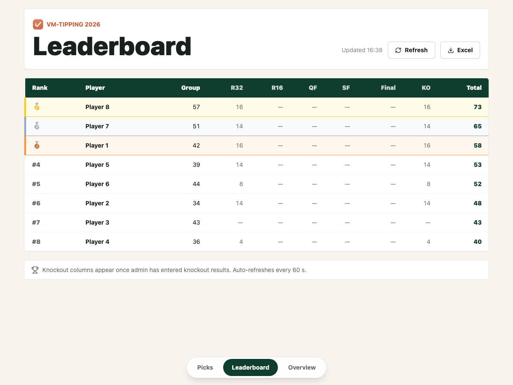
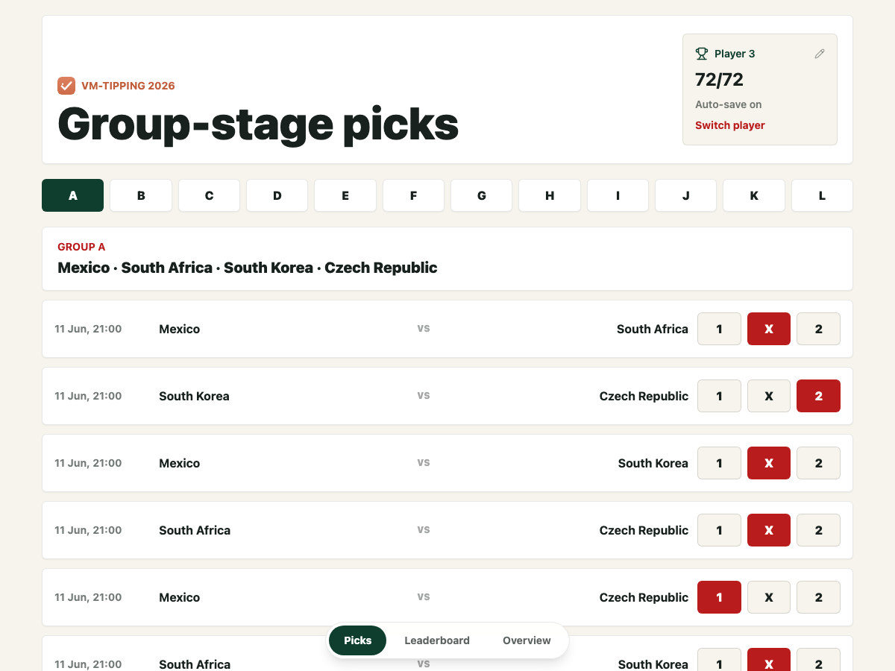
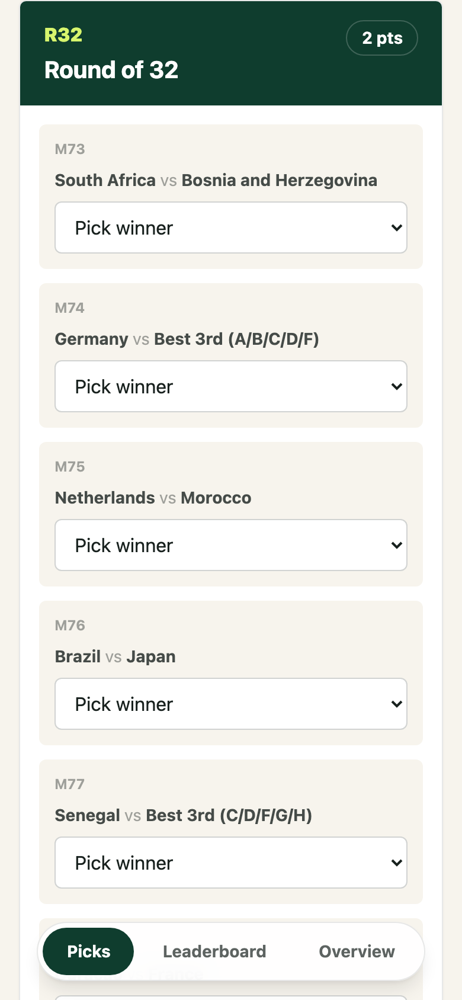

# VM-tipping 2026

A prediction league for the 2026 World Cup, built for eight friends. Everyone predicts the group games and the knockout bracket, an admin enters what really happened, and the leaderboard scores itself. It replaced the shared spreadsheet we used before, and we played the whole tournament on it.



| Group-stage picks | Knockout bracket (phone) |
|---|---|
|  |  |

Screenshots are from the local demo with made-up picks.

## Status

Finished. The league ran from the 11 June 2026 kickoff to the final, and nothing is deployed any more. The code still runs locally in demo mode. The deploy path it used is documented in [`ops/README.md`](ops/README.md).

## Quickstart

You need Node 22.13 or later (the server uses the built-in `node:sqlite`) and npm.

```bash
git clone https://github.com/hakon1233/vm-tipping-2026.git
cd vm-tipping-2026
npm ci
cp .env.example .env
npm run seed:demo   # optional: made-up picks and half a tournament of results
npm run dev
```

Then open <http://localhost:5173>:

- **Players.** Log in as any of `Player 1`–`Player 8` with the league PIN `demo-league`. Use the Leaderboard and Overview tabs at the bottom.
- **Admin.** Go to <http://localhost:5173/#/admin> and use the admin PIN `demo-admin`. Enter results there and watch the leaderboard change.

The API runs on port 3000 and stores its data in `server/data/vm-tipping.sqlite`; delete that file to start over. Teams, groups, the bracket and the default points come from [`data/seed.json`](data/seed.json).

## How it plays

| Pick | Points |
|---|---|
| Group game, correct `1` / `X` / `2` | 1 |
| Group winner / runner-up | 3 / 2 |
| Knockout: each correct team in the Round of 32 / 16 / quarter-final / semi-final / final | 2 / 3 / 4 / 5 / 6 |
| Champion | 7 |

- A team picked twice in one round scores once.
- Picks lock at the deadlines.
- Before the group-stage deadline, each player can see only their own picks.
- The admin can change the points, and the leaderboard can be downloaded as Excel.

The terms used in the code are defined in [`CONTEXT.md`](CONTEXT.md).

## How it works

```
web/ (React SPA) ──fetch──▶ server/ (Hono API) ──▶ SQLite file
        └──────── shared/ (types, group-match list) ────────┘
```

Three npm workspaces. The server is the only source of truth; the web app keeps a local copy of a player's knockout picks so a reload doesn't lose them.

| Module | What it owns |
|---|---|
| `server/src/app.ts` | The HTTP routes: request validation, pick deadlines, and who may see whose picks |
| `server/src/auth.ts` | League-PIN login, sessions, the admin PIN and the PIN-guess limit |
| `server/src/scoring.ts` | Scoring and ranking as one pure function: picks + results + points in, leaderboard out |
| `server/src/store.ts` | The SQLite schema, seeding from `data/seed.json`, and the queries |
| `server/src/exportXlsx.ts` | The Excel export, laid out like the original spreadsheet |
| `server/src/config.ts` | Reading the environment; refuses to start without the PINs |
| `shared/` | Types and the group-stage match list, used by both sides |
| `web/src/api.ts` | The only web module that talks to the server: API URL, auth headers, one retry, errors |
| `web/src/lib/knockout.ts` | Bracket rules: Round-of-32 slots from group picks, later matchups, what gets saved |
| `web/src/session.ts` | The logged-in player |
| `web/src/pages/` | One file per page. Pages only wire the modules above to the UI |
| `ops/` | The deploy scripts and their runbook |

### Why these choices

- **SQLite through `node:sqlite`.** One file, no native build step, plenty for eight players.
- **Hono.** It is small, and `app.request()` lets the tests call every route without starting a server.
- **Static site plus home server.** GitHub Pages hosted the web app, and the API ran on a Mac mini behind a Cloudflare tunnel. The site reads the API URL from `config.json` at runtime, so a tunnel restart needed no rebuild.
- **Hash routing** (`#/leaderboard`), so deep links work on a static host.

## Testing

Checks run locally; the repo runs no GitHub Actions.

```bash
npm run check       # typecheck (tests included), all tests, build
npm run test:e2e    # after a build; needs `npx playwright install chromium` once
```

`npm run typecheck` and `npm test` also run on their own.

- **Server.** Tests go through `app.request()` against an in-memory SQLite database. They cover login, sessions, the PIN-guess limit, deadlines, pick privacy, validation and the export. Scoring has its own tests with hand-computed values.
- **Web.** Tests render pages with Testing Library and stub only `fetch`.
- **End to end.** `test:e2e` starts the real API and the web app, then makes a pick, enters the result as admin and checks the leaderboard.

## Security

The access model is a shared league PIN plus an admin PIN. [`SECURITY.md`](SECURITY.md) explains the trade-offs and how to report a problem.

## How this was built

I built this with AI coding agents (Claude Code) in June 2026. I wrote the spec ([`SPEC.md`](SPEC.md)) and the scoring rules, reviewed the changes, and ran the league during the tournament.

In October 2026 a second agent-driven pass prepared the repo for publishing:

- security hardening
- splitting the web app into modules
- the test suite and one local check script
- these docs

## Licence

MIT — see [LICENSE](LICENSE).
